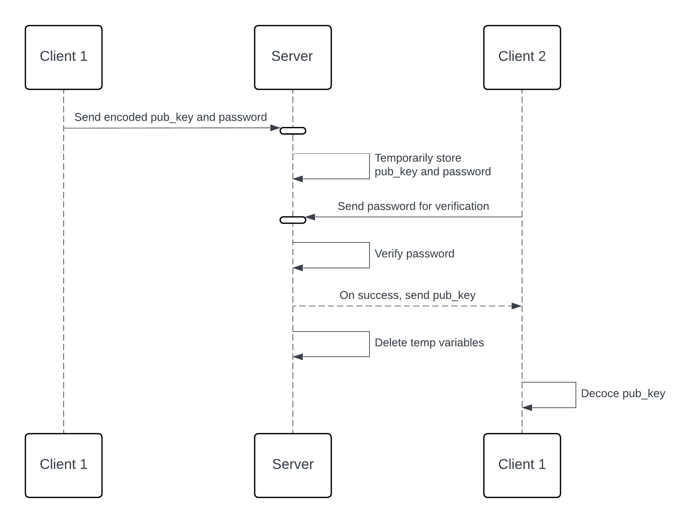
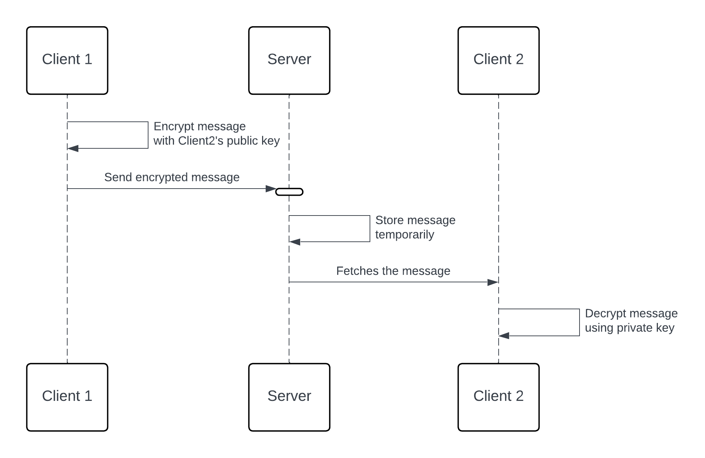

# tChat

Terminal chat application for developers. Share texts and files between users (or servers) using end-to-end encryption.

## Features

- [x] Send text messages
- [x] Send files
- [ ] Secure authentication
- [x] End-to-end encryption
- [ ] Live chat

## Working

### Public Key Sharing



### End-to-end Encryption



## Installation

1. For Mac and Linux:

```bash
curl https://raw.githubusercontent.com/tasnimzotder/tchat/main/install.sh | sudo sh
```

## Usage

To start the application, run the following command:

```bash
tchat
```

Please run the following command to start a new connection:

```bash
tchat conn
```

## Commands

| Command | Description              | Example                                 |
|---------|--------------------------|-----------------------------------------|
| `conn`  | Start or save connection | `tchat conn`                            |
| `msg`   | Receive messages         | `tchat msg -d 1 -s hello.txt`           |
| `send`  | Send messages            | `tchat send -r <receiver> -m <message>` |

### Message Command

| Option | Description                      | Example                       |
|--------|----------------------------------|-------------------------------|
| -c     | Clear the messages               | `tchat msg -c all`            |
| -d     | Display a message (serialNumber) | `tchat m -d 2`                |
| -s     | Save a message to file           | `tchat msg -d 2 -s hello.txt` |

### Send Command

| Option | Description | Example                                 |
|--------|-------------|-----------------------------------------|
| -r     | Receiver    | `tchat send -r <receiver> -m <message>` |
| -m     | Message     | `tchat send -r <receiver> -m <message>` |
| -f     | File        | `tchat send -r <receiver> -f <file>`    |
